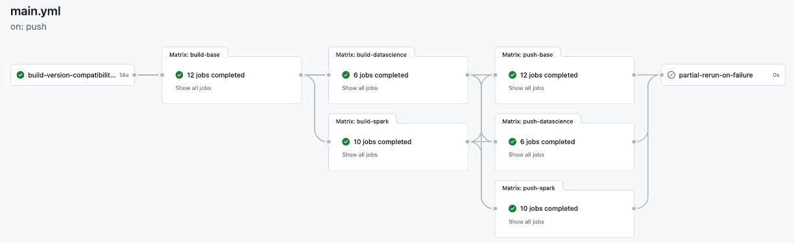

# OKDP Jupyter Images

[](https://github.com/OKDP/jupyterlab-docker/actions/workflows/main.yml)

OKDP jupyter docker images based on [jupyter docker-stacks](https://github.com/jupyter/docker-stacks) source dockerfiles. It includes (read only copy) [jupyter docker-stacks](https://github.com/jupyter/docker-stacks) repository as a [git-subtree](https://www.atlassian.com/git/tutorials/git-subtree) sub project.

The project leverages the features provided by [jupyter docker-stacks](https://github.com/jupyter/docker-stacks):
- Build from the original [source docker files](docker-stacks/images)
- Customize the images by using docker ```build-arg``` build arguments
- Run the original [tests](docker-stacks/tests) at every pipeline trigger

The project provides an up to date jupyter lab images especially for pyspark.

# Images build workflow
## Build/Test

The [ci](.github/workflows/ci.yml) build pipeline contains 6 main reusable workflows:

1. [build-base-images-template](.github/workflows/build-base-images-template.yml): docker-stacks-foundation, base-notebook, minimal-notebook, scipy-notebook
2. [build-datascience-images-template](.github/workflows/build-datascience-images-template.yml): r-notebook, julia-notebook, tensorflow-notebook, pytorch-notebook
3. [build-spark-images-template](.github/workflows/build-spark-images-template.yml): pyspark-notebook, all-spark-notebook
4. [publish](.github/workflows/publish.yml): push the built images to the container registry (main branch only)
5. [auto-rerun](.github/workflows/auto-rerun.yml): partially re-run jobs in case of failures (github runner issues/main branch only)
6. [ci](.github/workflows/ci.yml): run ci pipeline at every contribution



The build is based on the [version compatibility matrix](.build/.versions.yml).

The [build-matrix](.build/.versions.yml#L42) section defines the components versions to build. It behaves like a filter of the parent [compatibility-matrix](.build/.versions.yml#L5) section to limit the versions combintations to build. The build process ensures only the compatible versions are built:

For example, the following build-matrix:

```yaml
build-matrix:
  python_version: ['3.9', '3.10', '3.11']
  spark_version: [3.2.4, 3.3.4, 3.4.2, 3.5.0]
  java_version: [11, 17]
  scala_version: [2.12]
```

Will build the following versions combinations in regards to [compatibility-matrix](.build/.versions.yml#5) section:
- spark3.3.4-python3.10-java17-scala2.12
- spark3.5.0-python3.11-java17-scala2.12
- spark3.4.2-python3.11-java17-scala2.12
- spark3.2.4-python3.9-java11-scala2.12

By default, if no filter is specified:

```yaml
build-matrix:
```

All compatible versions combinations are built.

Finally, all the images are tested against the original [tests](docker-stacks/tests) at every pipeline trigger

## Push

Development images with tags ```-<GIT-BRANCH>-latest``` suffix (ex.: spark3.2.4-python3.9-java11-scala2.12-<GIT-BRANCH>-latest) are produced at every pipeline run regardless of the git branch (main or not).

The [official images](#tagging) are pushed to the [container registry](https://github.com/orgs/OKDP/packages) when:

1. The workflow is triggered on the main branch only and
2. The [tests](docker-stacks/tests) are completed successfully

This prevents pull requests or developement branchs to push the official images before they are reviewed or tested. It also provides the flexibility to test against developement images ```-<GIT-BRANCH>-latest``` before they are officially pushed.

## Tagging

The project builds the images with a long format tags. Each tag combines multiple compatible versions combinations.

There are multiple tags levels and the format to use is depending on your convenience in term of stability and reproducibility.

Here are some examples:

### scipy-notebook:
- python-3.11-2024-02-06
- python-3.11.7-2024-02-06
- python-3.11.7-hub-4.0.2-lab-4.1.0
- python-3.11.7-hub-4.0.2-lab-4.1.0-2024-02-06

### datascience-notebook:
- python-3.9-2024-02-06
- python-3.9.18-2024-02-06
- python-3.9.18-hub-4.0.2-lab-4.1.0
- python-3.9.18-hub-4.0.2-lab-4.1.0-2024-02-06
- python-3.9.18-r-4.3.2-julia-1.10.0-2024-02-06
- python-3.9.18-r-4.3.2-julia-1.10.0-hub-4.0.2-lab-4.1.0
- python-3.9.18-r-4.3.2-julia-1.10.0-hub-4.0.2-lab-4.1.0-2024-02-06

### pyspark-notebook:
- spark-3.5.0-python-3.11-java-17-scala-2.12
- spark-3.5.0-python-3.11-java-17-scala-2.12-2024-02-06
- spark-3.5.0-python-3.11.7-java-17.0.9-scala-2.12.18-hub-4.0.2-lab-4.1.0
- spark-3.5.0-python-3.11.7-java-17.0.9-scala-2.12.18-hub-4.0.2-lab-4.1.0-2024-02-06
- spark-3.5.0-python-3.11.7-r-4.3.2-java-17.0.9-scala-2.12.18-hub-4.0.2-lab-4.1.0
- spark-3.5.0-python-3.11.7-r-4.3.2-java-17.0.9-scala-2.12.18-hub-4.0.2-lab-4.1.0-2024-02-06

Please, check the [container registry](https://github.com/orgs/OKDP/packages) for more images and tags.

# Running github actions
## Github container registry credentials

Create the following [secrets and configuration variables](https://docs.github.com/en/actions/learn-github-actions/variables#creating-configuration-variables-for-a-repository) when running with your own github account or organization:

| Variable               | Type                    | Default  | Description                                 |
| -----------------------|-------------------------| ---------| ------------------------------------------- |
| `REGISTRY`             | Configuration variable  | ghcr.io  | Container registry                          |
| `REGISTRY_USERNAME`    | Secret variable         |          | Container registry username                 |
| `REGISTRY_ROBOT_TOKEN` | Secret variable         |          | Container registry password or access token `(Scopes: write:packages/delete:packages)` |

## Running locally with act

[Act](https://github.com/nektos/act) can be used to build and test locally.

Here is an example command:

```shell
$ act  --container-architecture linux/amd64  \
       -W .github/workflows/ci.yml \
       --env ACT_SKIP_TESTS=<true|false> \
       --var REGISTRY=ghcr.io  \
       --secret REGISTRY_USERNAME=<GITHUB_OWNER> \
       --secret REGISTRY_ROBOT_TOKEN=<GITHUB_CONTAINER_REGISTRY_TOKEN>
       --rm
```

set the option ```--container-architecture linux/amd64``` if you are running locally with Apple's M1/M2 chips.

For more information:

```shell
$ act  --help
```

# OKDP custom extensions

1. [Tagging extension](.build/python/okdp/extension/tagging) is based on the original [jupyter docker-stacks](docker-stacks/tagging) source files 
2. [Patchs](.build/python/okdp/patch/README.md) patchs the original [jupyter docker-stacks](docker-stacks/tests) in order to run the tests
3. [Version compatibility matrix](.build/python/okdp/extension/matrix) to generate all the compatible versions combintations for pyspark
4. [Unit tests](.build/python/tests) in order to test okdp extension at every pipeline run