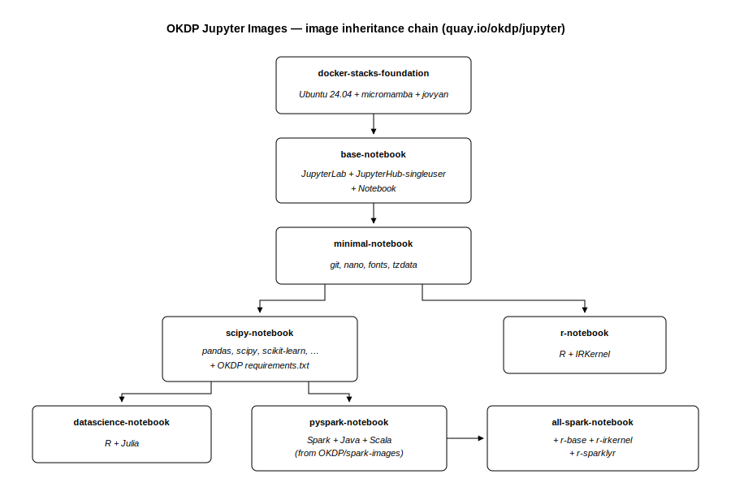

[](https://github.com/OKDP/jupyterlab-docker/actions/workflows/ci.yml)
[](https://github.com/OKDP/jupyterlab-docker/actions/workflows/release-please.yml)
[](https://github.com/OKDP/jupyterlab-docker/releases/latest)
[](http://www.apache.org/licenses/LICENSE-2.0)

# OKDP Jupyter Images

OKDP Jupyter Docker images built from the upstream [jupyter/docker-stacks](https://github.com/jupyter/docker-stacks) Dockerfiles, with an OKDP-maintained version compatibility matrix. The `pyspark-notebook` and `all-spark-notebook` images bundle Apache Spark binaries from the [OKDP Spark distribution](https://github.com/OKDP/spark-images/releases/tag/spark-tarballs) instead of `archive.apache.org`. The images are published to [`quay.io/okdp/jupyter`](https://quay.io/organization/okdp) and used as the singleuser image of the [OKDP sandbox](https://github.com/OKDP/okdp-sandbox) JupyterHub.

## Why this project

OKDP/jupyterlab-docker layers on top of `jupyter/docker-stacks` to ship JupyterLab images tailored for the OKDP data platform: a curated set of Python / Spark / Java / Scala combinations, Spark binaries hosted by OKDP, multi-arch builds, and a handful of data-engineering libraries pre-installed.

- **Curated compatibility matrix** — `.build/.versions.yml` pins the Python x Spark x Java x Scala x Hadoop combinations OKDP actually builds and tests (e.g. Python 3.10/3.11/3.12 against Spark 3.3.4, 3.4.2, 3.5.6 on Java 17 with Scala 2.12/2.13), spanning Spark 3.2.x through 4.0.x so you don't have to figure out which versions are mutually compatible.
- **Spark tarballs from `OKDP/spark-images`** — instead of pulling from `archive.apache.org`, every entry in the matrix sets `spark_download_url` to `https://github.com/OKDP/spark-images/releases/download/spark-tarballs/`, giving stable, OKDP-controlled artifacts that survive upstream archive churn.
- **Multi-arch images (`linux/amd64` + `linux/arm64`)** — published since v1.1.0, so the same tags run on x86 CI runners, x86 Kubernetes clusters, and Apple Silicon laptops without a separate build.
- **Extra Python packages baked into scipy-notebook and downstream images** — `scipy-notebook/requirements.txt` adds `jupyter-fs[fsspec]`, `s3fs`, `jupysql`, `trino`, `sqlalchemy-trino` and `nbgitpuller` on top of the upstream layer, so S3 browsing, Trino/SQL notebooks, and Git-based notebook sync work out of the box on OKDP.
- **OKDP override layer and custom Python extensions** — each image directory (e.g. `scipy-notebook/Dockerfile`, `pyspark-notebook/Dockerfile`) is a thin `COPY requirements.txt` + `pip install` layer on top of the upstream stage, while `.build/python/src/okdp/` carries OKDP-specific tooling: `extension/matrix` expands the compatibility matrix into a build matrix, `extension/tagging` generates the image tags, and `patch/` applies fixes against the upstream `docker-stacks` sources.

## What the project does

This repository builds and publishes a matrix of JupyterLab / JupyterHub container images. It vendors the upstream [`jupyter/docker-stacks`](https://github.com/jupyter/docker-stacks) source as a [git-subtree](https://www.atlassian.com/git/tutorials/git-subtree) under [`docker-stacks/`](docker-stacks) and adds:

- **An OKDP-maintained version compatibility matrix** ([`.build/.versions.yml`](.build/.versions.yml)) — combinations of Python, Spark, Java, Scala known to work together.
- **Spark binaries from the [OKDP Spark distribution](https://github.com/OKDP/spark-images/releases/tag/spark-tarballs)** — for `pyspark-notebook` and `all-spark-notebook`, the Spark tarballs are downloaded from `OKDP/spark-images` GitHub releases (see [`spark_download_url` in `.build/.versions.yml`](.build/.versions.yml#L30)) instead of `archive.apache.org/dist/spark/`.
- **Multi-arch images** for `linux/amd64` and `linux/arm64` (since [v1.1.0](https://github.com/OKDP/jupyterlab-docker/releases/tag/v1.1.0)).
- **Local override layer** — [`scipy-notebook/Dockerfile`](scipy-notebook/Dockerfile) adds extra Python packages from [`scipy-notebook/requirements.txt`](scipy-notebook/requirements.txt) (`jupyter-fs[fsspec]`, `s3fs`, `jupysql`, `trino`, `sqlalchemy-trino`, `nbgitpuller`) on top of the upstream `scipy-notebook` Dockerfile. [`pyspark-notebook/Dockerfile`](pyspark-notebook/Dockerfile) is wired the same way with an empty [`pyspark-notebook/requirements.txt`](pyspark-notebook/requirements.txt) as a placeholder — packages are inherited transitively from `scipy-notebook`.
- **Custom Python extensions** under [`.build/python/src/okdp/`](.build/python/src/okdp/) — tagging, compatibility-matrix expansion, patches and unit tests (see [Development](#development)).

## Components

All images are published under [`quay.io/okdp/jupyter`](https://quay.io/organization/okdp):

| Image | Description |
|:------|:------------|
| `docker-stacks-foundation` | Minimal Ubuntu + `mamba` + `jovyan` user. Foundation layer for all other images. |
| `base-notebook` | Adds JupyterLab, JupyterHub single-user, and Notebook. |
| `minimal-notebook` | Adds common CLI tools (`git`, `nano`, `tzdata`, fonts). |
| `scipy-notebook` | Adds the scientific Python stack (`pandas`, `scipy`, `matplotlib`, `scikit-learn`, `seaborn`, …) + OKDP additions ([`scipy-notebook/requirements.txt`](scipy-notebook/requirements.txt)): `jupyter-fs[fsspec]`, `s3fs`, `jupysql`, `trino`, `sqlalchemy-trino`, `nbgitpuller`. |
| `r-notebook` | `minimal-notebook` + R + IRKernel. |
| `datascience-notebook` | `scipy-notebook` + R + Julia. |
| `pyspark-notebook` | `scipy-notebook` + Apache Spark (from the [OKDP Spark distribution](https://github.com/OKDP/spark-images/releases/tag/spark-tarballs)) + Java + Scala. |
| `all-spark-notebook` | `pyspark-notebook` + R (`r-base`, `r-irkernel`, [`r-sparklyr`](https://spark.posit.co/)) for running R on Spark. |

> ℹ️ `julia-notebook`, `tensorflow-notebook` and `pytorch-notebook` exist as scaffolding in [`build-datascience-images-template.yml`](.github/workflows/build-datascience-images-template.yml) but are currently commented out and **not built or published**.

### Tag format

The project builds the images with long-format tags. Each tag combines multiple compatible version combinations. The examples below show the canonical tags published as of v1.3.0 (build date `2026-04-13`). Browse [`quay.io/okdp`](https://quay.io/organization/okdp) for the full list.

#### `scipy-notebook`
- `python-3.11-2026-04-13`
- `python-3.11.15-2026-04-13`
- `python-3.11.15-hub-5.4.4-lab-4.5.6`
- `python-3.11.15-hub-5.4.4-lab-4.5.6-2026-04-13`

#### `datascience-notebook`
- `python-3.11-2026-04-13`
- `python-3.11.15-2026-04-13`
- `python-3.11.15-hub-5.4.4-lab-4.5.6`
- `python-3.11.15-hub-5.4.4-lab-4.5.6-2026-04-13`
- `python-3.11.15-r-4.5.3-julia-1.12.6-2026-04-13`
- `python-3.11.15-r-4.5.3-julia-1.12.6-hub-5.4.4-lab-4.5.6`
- `python-3.11.15-r-4.5.3-julia-1.12.6-hub-5.4.4-lab-4.5.6-2026-04-13`

#### `pyspark-notebook`
- `spark-3.5.6-python-3.11-java-17-scala-2.13`
- `spark-3.5.6-python-3.11-java-17-scala-2.13-2026-04-13`
- `spark-3.5.6-python-3.11.15-java-17.0.18-scala-2.13.8-hub-5.4.4-lab-4.5.6`
- `spark-3.5.6-python-3.11.15-java-17.0.18-scala-2.13.8-hub-5.4.4-lab-4.5.6-2026-04-13`

## Architecture

OKDP Jupyter images follow the upstream [jupyter/docker-stacks](https://github.com/jupyter/docker-stacks) inheritance model: each image extends a parent, adding a focused set of libraries on top of the previous layer. The diagram below illustrates that chain, from the minimal `docker-stacks-foundation` up to specialized variants such as `all-spark-notebook`, `r-notebook`, and `datascience-notebook`. OKDP applies a thin override layer on top of `scipy-notebook` and `pyspark-notebook` to pin the additional dependencies declared in OKDP's `requirements.txt`.

For the canonical, upstream-maintained description of every image and what it ships, refer to the Jupyter Docker Stacks reference: [Selecting an Image](https://jupyter-docker-stacks.readthedocs.io/en/latest/using/selecting.html).

<p align="center"></p>

The OKDP override layer (highlighted on `scipy-notebook` and `pyspark-notebook`) is where OKDP-specific packages from `requirements.txt` are installed on top of the upstream image content.

## Prerequisites

Before running the images in this repository, make sure your host meets the following baseline. The values below reflect the environment that was used to end-to-end test the reference image.

- **Docker** with BuildKit enabled (recommended for faster, more reliable builds). Tested version: Docker Desktop 28.2.2 on macOS arm64.
- **Free disk space**: at least ~7 GB available for the `pyspark-notebook` image on disk after pull. Allow additional headroom for layer caches, build artifacts, and mounted workspace data.
- **Free TCP port 8888** on the host, used to expose the JupyterLab UI. If the port is already in use, remap it at run time with `-p <host-port>:8888`.
- **Tested image** (pulled and end-to-end tested locally on 2026-04-13):
  - Tag: `quay.io/okdp/jupyter/pyspark-notebook:spark-3.5.6-python-3.11-java-17-scala-2.13`
  - Digest: `sha256:e1662ba16c81d4eddc636b33aaabb7aedd74aef25253e6a4327f20fdcabb69f8`

To pin the exact tested artifact (recommended for reproducibility), reference the image by digest:

```bash
docker pull quay.io/okdp/jupyter/pyspark-notebook@sha256:e1662ba16c81d4eddc636b33aaabb7aedd74aef25253e6a4327f20fdcabb69f8
```

Other host operating systems and Docker versions are expected to work but have not been verified against this baseline.

## Quick Start

Pull and run the `pyspark-notebook` image — the canonical OKDP image, which bundles Apache Spark, Java 17, Scala 2.13 and the scientific Python stack:

```sh
docker pull quay.io/okdp/jupyter/pyspark-notebook:spark-3.5.6-python-3.11-java-17-scala-2.13

docker run --rm -p 8888:8888 \
  quay.io/okdp/jupyter/pyspark-notebook:spark-3.5.6-python-3.11-java-17-scala-2.13
```

### Expected result

The container starts JupyterLab on port `8888` (via the upstream [`start-notebook.py`](docker-stacks/images/base-notebook/start-notebook.py) entrypoint) and prints a one-time access URL containing a token, for example:

```
[I ServerApp] Jupyter Server 2.x is running at:
[I ServerApp] http://localhost:8888/lab?token=<random-token>
[I ServerApp]     http://127.0.0.1:8888/lab?token=<random-token>
```

Open the `http://127.0.0.1:8888/lab?token=...` URL in your browser to reach the JupyterLab UI.

## Installation

All images are published to [`quay.io/okdp/jupyter`](https://quay.io/organization/okdp). Pull syntax:

```sh
docker pull quay.io/okdp/jupyter/<image>:<tag>
```

Where `<image>` is one of `docker-stacks-foundation`, `base-notebook`, `minimal-notebook`, `scipy-notebook`, `r-notebook`, `datascience-notebook`, `pyspark-notebook`, `all-spark-notebook` — and `<tag>` is any [published tag](#components) (the recommended pyspark tag as of v1.3.0 is `spark-3.5.6-python-3.11-java-17-scala-2.13`).

### Cleanup

When you are done experimenting, stop the container and (optionally) remove the image to reclaim disk space (~7 GB).

**Stop the container**

If the container is running in the foreground, press `Ctrl-C` in the terminal where it was launched.

If it is running detached, find its ID and stop it:

```bash
docker ps                       # list running containers
docker stop <container-id>      # graceful stop
```

**Remove the container**

The Quick Start uses `--rm`, so the container is deleted automatically on exit. If you launched it without `--rm`, remove it manually:

```bash
docker ps -a                    # list all containers (including stopped)
docker rm <container-id>        # remove a stopped container
```

**Remove the image**

The PySpark notebook image is large (~7 GB). Remove it once you no longer need it:

```bash
docker images                                                                            # list local images
docker rmi quay.io/okdp/jupyter/pyspark-notebook:spark-3.5.6-python-3.11-java-17-scala-2.13
```

If `docker rmi` reports the image is still in use, stop and remove any container based on it first (see steps above).

## Configuration

### Build arguments

When rebuilding an image from `docker-stacks/images/<image>/Dockerfile`, the following `--build-arg` values are honoured (extracted from the upstream Dockerfiles):

| Build arg | Used in | Default | Description |
|:---|:---|:---|:---|
| `REGISTRY` | all | `quay.io` | Registry hosting the base image. |
| `OWNER` | all | `jupyter` | Owner of the base image — set to `okdp/jupyter` to chain off OKDP images. |
| `BASE_IMAGE` | all | `${REGISTRY}/${OWNER}/<parent>` | Full base image reference. |
| `ROOT_IMAGE` | `docker-stacks-foundation` | `ubuntu:24.04` | The Ubuntu base. |
| `NB_USER` | `docker-stacks-foundation` | `jovyan` | UNIX user inside the container. |
| `NB_UID` | `docker-stacks-foundation` | `1000` | UID of `NB_USER`. |
| `NB_GID` | `docker-stacks-foundation` | `100` | GID `NB_USER` belongs to. |
| `PYTHON_VERSION` | `docker-stacks-foundation` | `3.13` | Python version installed in the conda env. |
| `openjdk_version` | `pyspark-notebook` | `17` | OpenJDK major version. |
| `spark_version` | `pyspark-notebook` | *(required)* | Apache Spark version to bundle. |
| `hadoop_version` | `pyspark-notebook` | `3` | Hadoop major version embedded in the Spark tarball. |
| `scala_version` | `pyspark-notebook` | *(required)* | Scala version. |
| `spark_download_url` | `pyspark-notebook` | `https://dlcdn.apache.org/spark/` | Base URL for the Spark tarball — OKDP overrides this to `https://github.com/OKDP/spark-images/releases/download/spark-tarballs/` via [`.build/.versions.yml#L30`](.build/.versions.yml#L30). |

### Runtime environment variables

The defaults work out of the box — the [Quick Start](#quick-start) does not set any env variable. Runtime configuration is inherited from upstream `jupyter/docker-stacks`: see [common features](https://jupyter-docker-stacks.readthedocs.io/en/latest/using/common.html) for the full list of `-e VAR=value` flags (`NB_USER`, `NB_UID`, `GRANT_SUDO`, `CHOWN_HOME`, …) and [the upstream `pyspark-notebook` page](https://jupyter-docker-stacks.readthedocs.io/en/latest/using/specifics.html#apache-spark) for `SPARK_OPTS`.

## Alternatives

If you only need a JupyterLab image and are not committed to the OKDP stack, consider the following alternatives.

| Name | Description | When to choose |
| --- | --- | --- |
| [jupyter/docker-stacks](https://github.com/jupyter/docker-stacks) | Upstream Jupyter community images that this repository is forked from. | You want the canonical upstream Dockerfiles without OKDP overrides, and you do not need the pre-built Spark integration wired to OKDP `spark-tarballs`. |
| [Zero to JupyterHub on Kubernetes (Z2JH)](https://z2jh.jupyter.org/) | Official Helm chart for running a multi-user JupyterHub on Kubernetes. | You need a managed multi-user JupyterHub on Kubernetes and are happy to bring your own single-user image (which can still be this one). |
| [The Littlest JupyterHub (TLJH)](https://tljh.jupyter.org/) | Single-VM JupyterHub distribution targeted at small teams and classrooms. | You have fewer than ~100 users, want a single-server install, and do not need Kubernetes or Spark. |
| [rocker/r-ver](https://hub.docker.com/r/rocker/r-ver) or [python/python](https://hub.docker.com/_/python) | Language-focused base images (R-centric Rocker stack, or plain Python) without a Jupyter UI. | You only need a language runtime for batch jobs or custom apps, and do not need JupyterLab at all. |

Pick `OKDP/jupyterlab-docker` when you are deploying as part of the OKDP data platform stack, want Spark integration matched to `OKDP/spark-images`, and need multi-arch (amd64/arm64) images out of the box.

## Build

The [`ci`](.github/workflows/ci.yml) build pipeline is composed of the following workflows (the `*-template.yml` files under [`.github/workflows/`](.github/workflows/) are reusable workflows called from `ci.yml` and `publish.yml`):

1. [`build-base-images-template`](.github/workflows/build-base-images-template.yml): `docker-stacks-foundation`, `base-notebook`, `minimal-notebook`, `scipy-notebook`
2. [`build-datascience-images-template`](.github/workflows/build-datascience-images-template.yml): `r-notebook`, `datascience-notebook` (`julia-notebook`, `tensorflow-notebook` and `pytorch-notebook` are commented out)
3. [`build-spark-images-template`](.github/workflows/build-spark-images-template.yml): `pyspark-notebook`, `all-spark-notebook`
4. [`publish`](.github/workflows/publish.yml): push the built images to the container registry (main branch only)
5. [`auto-rerun`](.github/workflows/auto-rerun.yml): partially re-run jobs in case of failures (GitHub runner issues / main branch only)
6. [`ci`](.github/workflows/ci.yml): run CI pipeline at every contribution


The build is driven by [`.build/.versions.yml`](.build/.versions.yml). The [`build-matrix`](.build/.versions.yml#L80) section defines which component versions to build — it filters the parent [`compatibility-matrix`](.build/.versions.yml#L21) to limit the combinations actually built. Example:

```yaml
build-matrix:
  python_version: ['3.10', '3.11', '3.12']
  spark_version: [3.3.4, 3.4.2, 3.5.6]
  java_version: [17]
  scala_version: [2.12, 2.13]
```

→ produces these 6 compatible combinations (filtered against the `compatibility-matrix` — incompatible pairs like `python 3.10 + spark 3.5.x` or `python 3.12 + spark 3.x` are silently dropped):

- `spark3.3.4-python3.10-java17-scala2.12`
- `spark3.3.4-python3.10-java17-scala2.13`
- `spark3.4.2-python3.11-java17-scala2.12`
- `spark3.4.2-python3.11-java17-scala2.13`
- `spark3.5.6-python3.11-java17-scala2.12`
- `spark3.5.6-python3.11-java17-scala2.13`

### Publishing

Development images with the `-<GIT-BRANCH>-latest` suffix (e.g. `spark3.5.6-python3.11-java17-scala2.13-<GIT-BRANCH>-latest`) are produced at every pipeline run, regardless of the git branch.

Official images are published to [`quay.io/okdp/jupyter`](https://quay.io/organization/okdp) at every release **and** periodically, every Monday at 05:00 GMT (to pick up upstream security updates — see the `cron: "0 5 * * 1"` schedule in [`publish.yml`](.github/workflows/publish.yml)).

### Running locally with `act`

[`act`](https://github.com/nektos/act) can be used to run the workflows locally:

```sh
act --container-architecture linux/amd64 \
    -W .github/workflows/ci.yml \
    --env ACT_SKIP_TESTS=<true|false> \
    --secret GITHUB_TOKEN=<GITHUB_TOKEN> \
    --rm
```

(use `--container-architecture linux/amd64` on Apple Silicon — M1/M2/M3 — Macs.)

## Test

With a `pyspark-notebook` container running (see [Quick Start](#quick-start)):

```sh
# Should return 200 (curl -L follows the redirect to the JupyterLab login page).
# A plain GET without -L returns 302 — that is expected, Jupyter redirects to /login with the token.
# Note: -I (HEAD) returns 405 because Jupyter rejects HEAD on /lab.
curl -sL -o /dev/null -w "%{http_code}\n" http://127.0.0.1:8888/lab
```

### Expected result

```
200
```

For `pyspark-notebook` / `all-spark-notebook`, run a one-liner `SparkPi` job from inside the running container to confirm Spark is wired up:

```sh
CONTAINER_ID=$(docker ps --filter ancestor=quay.io/okdp/jupyter/pyspark-notebook --format '{{.ID}}' | head -1)

docker exec "$CONTAINER_ID" bash -lc '
  $SPARK_HOME/bin/spark-submit \
    --class org.apache.spark.examples.SparkPi \
    --master "local[2]" \
    $SPARK_HOME/examples/jars/spark-examples_*.jar 100 2>&1 | grep "Pi is roughly"
'
```

### Expected result

```
Pi is roughly 3.1407...
```

CI runs the upstream [`docker-stacks` tests](docker-stacks/tests) at every pipeline trigger, plus the OKDP [unit tests](.build/python/tests).

## Troubleshooting

Below are common issues you may encounter when running the OKDP JupyterLab images, along with their root causes and recommended fixes.

- **Port 8888 already in use.** Another container or a local Jupyter instance is already bound to port 8888 on the host. Map a different host port when starting the container:

  ```bash
  docker run -p 8889:8888 okdp/jupyterlab-pyspark-notebook:latest
  ```

  Then open `http://localhost:8889` in your browser.

- **Permission denied when saving files in a mounted volume.** The host user's UID/GID does not match the container's default `jovyan` user (`1000:100`), so writes to the bind mount are rejected. Run the container as your host user and let the entrypoint fix ownership of the home directory:

  ```bash
  docker run \
    -e NB_UID=$(id -u) \
    -e NB_GID=$(id -g) \
    -e CHOWN_HOME=yes \
    --user root \
    -v "$PWD":/home/jovyan/work \
    okdp/jupyterlab-pyspark-notebook:latest
  ```

  See the upstream [jupyter-docker-stacks common features](https://jupyter-docker-stacks.readthedocs.io/en/latest/using/common.html) for the full list of supported variables.

- **Spark job runs out of memory.** The default `SPARK_OPTS` caps the driver heap at `-Xmx4096M`, which is too small for larger workloads. Override `SPARK_OPTS` to raise the driver heap (and any other JVM options you need):

  ```bash
  docker run -e SPARK_OPTS="--driver-java-options=-Xmx8g" \
    okdp/jupyterlab-pyspark-notebook:latest
  ```

- **Pull is very slow or fails with "no space left on device".** The `pyspark-notebook` image is roughly 7 GB on disk, which can exhaust Docker's storage on smaller hosts. Free up space (`docker system prune`) or first pull a smaller variant such as `base-notebook` to validate connectivity and registry access before pulling the full PySpark image:

  ```bash
  docker pull okdp/jupyterlab-base-notebook:latest
  ```

## License

[Apache License 2.0](LICENSE)

---

**Built 🚀 for the OKDP Community **