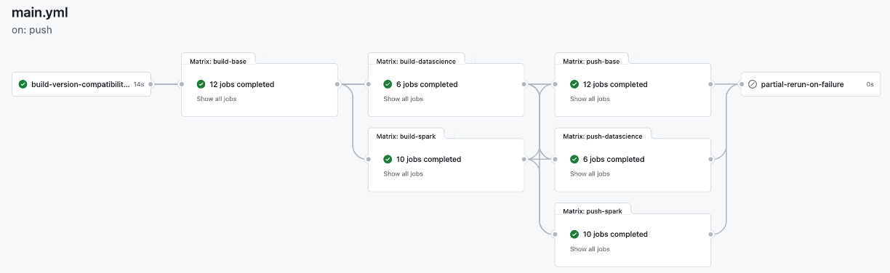

# OKDP Jupyter Images

[](https://github.com/OKDP/jupyterlab-docker/actions/workflows/ci.yml)
[](https://github.com/OKDP/jupyterlab-docker/actions/workflows/release-please.yml)
[](https://github.com/OKDP/jupyterlab-docker/releases/latest)
[](http://www.apache.org/licenses/LICENSE-2.0)
<a href="https://okdp.io">
  
</a>

<p align="center">
    
</p>

OKDP Jupyter Docker images built from the upstream [jupyter/docker-stacks](https://github.com/jupyter/docker-stacks) Dockerfiles, with an OKDP-maintained version compatibility matrix. The `pyspark-notebook` and `all-spark-notebook` images bundle Apache Spark binaries from the [OKDP Spark distribution](https://github.com/OKDP/spark-images/releases/tag/spark-tarballs) instead of `archive.apache.org`.

## What is OKDP Jupyter Images?

This repository builds and publishes a matrix of JupyterLab / JupyterHub container images to [`quay.io/okdp/jupyter`](https://quay.io/organization/okdp). It vendors the upstream [`jupyter/docker-stacks`](https://github.com/jupyter/docker-stacks) source as a [git-subtree](https://www.atlassian.com/git/tutorials/git-subtree) under [`docker-stacks/`](docker-stacks) and adds:

- **An OKDP-maintained version compatibility matrix** ([`.build/.versions.yml`](.build/.versions.yml)) — combinations of Python, Spark, Java, Scala known to work together.
- **Spark binaries from the [OKDP Spark distribution](https://github.com/OKDP/spark-images/releases/tag/spark-tarballs)** — for `pyspark-notebook` and `all-spark-notebook`, the Spark tarballs are downloaded from `OKDP/spark-images` GitHub releases (see [`spark_download_url` in `.build/.versions.yml`](.build/.versions.yml#L30)) instead of `archive.apache.org/dist/spark/`.
- **Multi-arch images** for `linux/amd64` and `linux/arm64` (since [v1.1.0](https://github.com/OKDP/jupyterlab-docker/releases/tag/v1.1.0)).
- **Local overrides** under [`pyspark-notebook/`](pyspark-notebook) and [`scipy-notebook/`](scipy-notebook) — extra requirements (e.g. [`nbgitpuller`](https://github.com/jupyterhub/nbgitpuller), `s3fs`, `trino`, `jupysql`) baked into the OKDP images on top of the upstream `Dockerfile`.
- **Custom Python extensions** under [`.build/python/src/okdp/`](.build/python/src/okdp/) — see [OKDP custom extensions](#okdp-custom-extensions) below.

The images leverage the features provided by [`jupyter/docker-stacks`](https://github.com/jupyter/docker-stacks):

- Build from the upstream [source Dockerfiles](docker-stacks/images).
- Customize via Docker `--build-arg` arguments.
- Run the upstream [tests](docker-stacks/tests) at every pipeline trigger.
- Provide [multi-arch](https://docs.docker.com/build/building/multi-platform/) images for `linux/amd64` and `linux/arm64`.

## Image variants

All images are published under [`quay.io/okdp/jupyter`](https://quay.io/organization/okdp) and follow the upstream [`jupyter/docker-stacks` inheritance chain](https://jupyter-docker-stacks.readthedocs.io/en/latest/using/selecting.html):

| Image | Description |
|:------|:------------|
| `docker-stacks-foundation` | Minimal Ubuntu + `mamba` + `jovyan` user. Foundation layer for all other images. |
| `base-notebook` | Adds JupyterLab, JupyterHub single-user, and Notebook. |
| `minimal-notebook` | Adds common CLI tools (`git`, `nano`, `tzdata`, fonts). |
| `scipy-notebook` | Adds the scientific Python stack (`pandas`, `scipy`, `matplotlib`, `scikit-learn`, `seaborn`, …) + OKDP additions ([`scipy-notebook/requirements.txt`](scipy-notebook/requirements.txt)): `jupyter-fs[fsspec]`, `s3fs`, `jupysql`, `trino`, `sqlalchemy-trino`, `nbgitpuller`. |
| `r-notebook` | `minimal-notebook` + R + IRKernel. |
| `datascience-notebook` | `scipy-notebook` + R + Julia. |
| `pyspark-notebook` | `scipy-notebook` + Apache Spark (from the [OKDP Spark distribution](https://github.com/OKDP/spark-images/releases/tag/spark-tarballs)) + Java + Scala. |
| `all-spark-notebook` | `pyspark-notebook` + R (`r-base`, `r-irkernel`, [`r-sparklyr`](https://spark.posit.co/)) for running R on Spark. |

> ℹ️ `julia-notebook`, `tensorflow-notebook` and `pytorch-notebook` exist as scaffolding in [`build-datascience-images-template.yml`](.github/workflows/build-datascience-images-template.yml) but are currently commented out and **not built or published**.

## Prerequisites

- [Docker](https://www.docker.com/) (BuildKit recommended).
- Enough free disk for the image you pull — `pyspark-notebook` is ~7 GB on disk after pull; `base-notebook` is significantly smaller.
- A free port `8888` on the host for the JupyterLab UI.

## Quick Start

Pull and run the `pyspark-notebook` image — the canonical OKDP image, which bundles Apache Spark, Java 17, Scala 2.13 and the scientific Python stack:

```sh
docker pull quay.io/okdp/jupyter/pyspark-notebook:spark-3.5.6-python-3.11-java-17-scala-2.13

docker run --rm -p 8888:8888 \
  quay.io/okdp/jupyter/pyspark-notebook:spark-3.5.6-python-3.11-java-17-scala-2.13
```

The container starts JupyterLab on port `8888` (via the upstream [`start-notebook.py`](docker-stacks/images/base-notebook/start-notebook.py) entrypoint) and prints a one-time access URL containing a token, for example:

```
[I ServerApp] Jupyter Server 2.x is running at:
[I ServerApp] http://localhost:8888/lab?token=<random-token>
[I ServerApp]     http://127.0.0.1:8888/lab?token=<random-token>
```

Open the `http://127.0.0.1:8888/lab?token=...` URL in your browser to reach the JupyterLab UI.

> Replace `pyspark-notebook` with any other image variant from the [table above](#image-variants), and `spark-3.5.6-python-3.11-java-17-scala-2.13` with any other published tag (see [Tagging](#tagging) and the [Releases](https://github.com/OKDP/jupyterlab-docker/releases) page for the full matrix).

## Verify your deployment

With the container running:

```sh
# Should return 200 (follows the redirect to the JupyterLab login page).
# A plain GET without -L returns 302 — that is expected, Jupyter redirects
# to /login with the token. Note: -I (HEAD) returns 405 because Jupyter
# rejects HEAD on /lab.
curl -sL -o /dev/null -w "%{http_code}\n" http://127.0.0.1:8888/lab
# 200
```

For `pyspark-notebook` / `all-spark-notebook`, you can run a one-liner SparkPi job from inside the running container to confirm Spark is wired up:

```sh
CONTAINER_ID=$(docker ps --filter ancestor=quay.io/okdp/jupyter/pyspark-notebook --format '{{.ID}}' | head -1)

docker exec "$CONTAINER_ID" bash -lc '
  $SPARK_HOME/bin/spark-submit \
    --class org.apache.spark.examples.SparkPi \
    --master "local[2]" \
    $SPARK_HOME/examples/jars/spark-examples_*.jar 100 2>&1 | grep "Pi is roughly"
'
# Pi is roughly 3.1407...
```

# Images build workflow
## Build/Test

The [ci](.github/workflows/ci.yml) build pipeline is composed of the following workflows (the `*-template.yml` files under [`.github/workflows/`](.github/workflows/) are reusable workflows called from `ci.yml` and `publish.yml`):

1. [build-base-images-template](.github/workflows/build-base-images-template.yml): docker-stacks-foundation, base-notebook, minimal-notebook, scipy-notebook
2. [build-datascience-images-template](.github/workflows/build-datascience-images-template.yml): r-notebook, datascience-notebook (`julia-notebook`, `tensorflow-notebook` and `pytorch-notebook` are currently commented out in this template)
3. [build-spark-images-template](.github/workflows/build-spark-images-template.yml): pyspark-notebook, all-spark-notebook
4. [publish](.github/workflows/publish.yml): push the built images to the container registry (main branch only)
5. [auto-rerun](.github/workflows/auto-rerun.yml): partially re-run jobs in case of failures (github runner issues/main branch only)
6. [ci](.github/workflows/ci.yml): run ci pipeline at every contribution



The build is based on the [version compatibility matrix](.build/.versions.yml).

The [build-matrix](.build/.versions.yml#L80) section defines the component versions to build. It behaves like a filter of the parent [compatibility-matrix](.build/.versions.yml#L21) section to limit the version combinations to build. The build process ensures only compatible versions are built:

For example, the following `build-matrix`:

```yaml
build-matrix:
  python_version: ['3.10', '3.11', '3.12']
  spark_version: [3.3.4, 3.4.2, 3.5.6]
  java_version: [17]
  scala_version: [2.12, 2.13]
```

Will build the following version combinations in regard to the [compatibility-matrix](.build/.versions.yml#L21) section:
- spark3.3.4-python3.10-java17-scala2.12
- spark3.3.4-python3.10-java17-scala2.13
- spark3.4.2-python3.11-java17-scala2.12
- spark3.4.2-python3.11-java17-scala2.13
- spark3.5.6-python3.11-java17-scala2.12
- spark3.5.6-python3.11-java17-scala2.13

By default, if no filter is specified:

```yaml
build-matrix:
```

all compatible version combinations are built.

Finally, all the images are tested against the upstream [tests](docker-stacks/tests) at every pipeline trigger.

## Publishing

Development images with the `-<GIT-BRANCH>-latest` suffix (e.g. `spark3.5.6-python3.11-java17-scala2.13-<GIT-BRANCH>-latest`) are produced at every pipeline run, regardless of the git branch (main or not).

The [official images](#tagging) are published to the [OKDP quay.io registry](https://quay.io/organization/okdp):

1. At every release, and
2. Periodically, every Monday at 05:00 GMT (to pick up upstream security updates).


## Tagging

The project builds the images with long-format tags. Each tag combines multiple compatible version combinations.

There are multiple tag levels — the format to use depends on your convenience in terms of stability and reproducibility.

The examples below show the canonical tags published as of v1.3.0 (build date `2026-04-13`). For the full list, browse the corresponding repositories on [quay.io/okdp](https://quay.io/organization/okdp).

### scipy-notebook
- `python-3.11-2026-04-13`
- `python-3.11.15-2026-04-13`
- `python-3.11.15-hub-5.4.4-lab-4.5.6`
- `python-3.11.15-hub-5.4.4-lab-4.5.6-2026-04-13`

### datascience-notebook
- `python-3.11-2026-04-13`
- `python-3.11.15-2026-04-13`
- `python-3.11.15-hub-5.4.4-lab-4.5.6`
- `python-3.11.15-hub-5.4.4-lab-4.5.6-2026-04-13`
- `python-3.11.15-r-4.5.3-julia-1.12.6-2026-04-13`
- `python-3.11.15-r-4.5.3-julia-1.12.6-hub-5.4.4-lab-4.5.6`
- `python-3.11.15-r-4.5.3-julia-1.12.6-hub-5.4.4-lab-4.5.6-2026-04-13`

### pyspark-notebook
- `spark-3.5.6-python-3.11-java-17-scala-2.13`
- `spark-3.5.6-python-3.11-java-17-scala-2.13-2026-04-13`
- `spark-3.5.6-python-3.11.15-java-17.0.18-scala-2.13.8-hub-5.4.4-lab-4.5.6`
- `spark-3.5.6-python-3.11.15-java-17.0.18-scala-2.13.8-hub-5.4.4-lab-4.5.6-2026-04-13`

Pull syntax — replace `<image>` with one of `docker-stacks-foundation`, `base-notebook`, `minimal-notebook`, `scipy-notebook`, `r-notebook`, `datascience-notebook`, `pyspark-notebook`, `all-spark-notebook`:

```sh
docker pull quay.io/okdp/jupyter/<image>:<tag>
```

Please check the [OKDP quay.io registry](https://quay.io/organization/okdp) for the full list of images and tags.

# Running GitHub Actions
## Official registry (quay.io) credentials

Create the following [secrets and configuration variables](https://docs.github.com/en/actions/learn-github-actions/variables#creating-configuration-variables-for-a-repository) when running with your own github account or organization:

| Variable               | Type                    | Default  | Description                                 |
| -----------------------|-------------------------| ---------| ------------------------------------------- |
| `REGISTRY`             | Configuration variable  | quay.io  | Container registry                          |
| `REGISTRY_USERNAME`    | Secret variable         |          | Container registry username                 |
| `REGISTRY_ROBOT_TOKEN` | Secret variable         |          | Container registry password or access token `(Scopes: write:packages/delete:packages)` |

## Running locally with act

[Act](https://github.com/nektos/act) can be used to build and test locally.

Here is an example command:

```shell
$ act  --container-architecture linux/amd64  \
       -W .github/workflows/ci.yml \
       --env ACT_SKIP_TESTS=<true|false> \
       --secret GITHUB_TOKEN=<GITHUB_TOKEN> \
       --rm
```

set the option ```--container-architecture linux/amd64``` if you are running locally with Apple's M1/M2 chips.

For more information:

```shell
$ act  --help
```

# OKDP custom extensions

1. [Tagging extension](.build/python/src/okdp/extension/tagging) — based on the upstream [jupyter/docker-stacks tagging](docker-stacks/tagging) sources.
2. [Patches](.build/python/src/okdp/patch/README.md) — patches the upstream [jupyter/docker-stacks tests](docker-stacks/tests) so they run against the OKDP image matrix.
3. [Version compatibility matrix](.build/python/src/okdp/extension/matrix) — generates all compatible version combinations for the pyspark build.
4. [Unit tests](.build/python/tests) — exercise the OKDP extensions at every pipeline run.


## Update jupyter/docker-stacks

The [docker-stacks](./docker-stacks) folder is included in this repository using **[git subtree](https://www.atlassian.com/git/tutorials/git-subtree)**.  
This means the upstream [`jupyter/docker-stacks`](https://github.com/jupyter/docker-stacks) code is fully copied into our repo, so contributors don’t need to worry about submodules or special clone flags.

To bring in the latest changes from upstream:

```shell
# Add the upstream remote
git remote add docker-stacks https://github.com/jupyter/docker-stacks.git

# Fetch the latest commits from upstream
git fetch docker-stacks

# Merge upstream changes into docker-stacks/ folder and squash the history
git subtree pull --prefix=docker-stacks docker-stacks main --squash
```

Make sure the [OKDP custom extensions](#okdp-custom-extensions) work correctly by running at least the [unit tests](.build/python/tests).

---

**Built 🚀 for the OKDP Community**
<a href="https://okdp.io">
  
</a>
