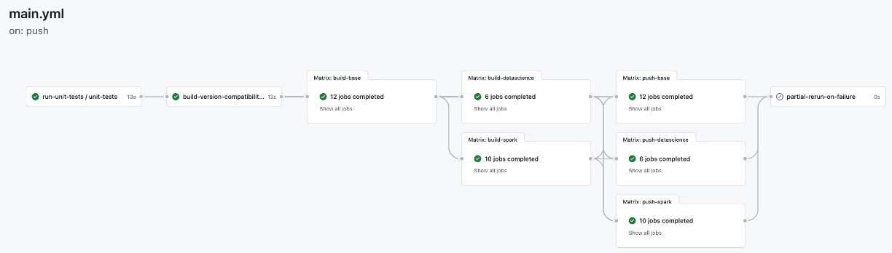

# OKDP Jupyter Images

[](https://github.com/OKDP/jupyterlab-docker/actions/workflows/main.yml)

OKDP jupyter docker images based on [jupyter docker-stacks](https://github.com/jupyter/docker-stacks) source dockerfiles. It includes (read only copy) [jupyter docker-stacks](https://github.com/jupyter/docker-stacks) repository as a [git-subtree](https://www.atlassian.com/git/tutorials/git-subtree) sub project.

The project leverages the features provided by [jupyter docker-stacks](https://github.com/jupyter/docker-stacks):
- Build from the original [source docker files](docker-stacks/images)
- Customize the images by using docker ```build-arg``` build arguments
- Run the original [tests](docker-stacks/tests) at every pipeline trigger
- Provides [multi-arch](https://docs.docker.com/build/building/multi-platform/) images that can run on both linux/amd64 and linux/arm64

The project provides an up to date jupyter lab images especially for pyspark.

# Images build workflow
## Build/Test

The [ci](.github/workflows/ci.yml) build pipeline contains 6 main reusable workflows:

1. [build-base-images-template](.github/workflows/build-base-images-template.yml): docker-stacks-foundation, base-notebook, minimal-notebook, scipy-notebook
2. [build-datascience-images-template](.github/workflows/build-datascience-images-template.yml): r-notebook, julia-notebook, tensorflow-notebook, pytorch-notebook
3. [build-spark-images-template](.github/workflows/build-spark-images-template.yml): pyspark-notebook, all-spark-notebook
4. [publish](.github/workflows/publish.yml): push the built images to the container registry (main branch only)
5. [auto-rerun](.github/workflows/auto-rerun.yml): partially re-run jobs in case of failures (github runner issues/main branch only)
6. [ci](.github/workflows/ci.yml): run ci pipeline at every contribution



The build is based on the [version compatibility matrix](.build/.versions.yml).

The [build-matrix](.build/.versions.yml#L42) section defines the components versions to build. It behaves like a filter of the parent [compatibility-matrix](.build/.versions.yml#L5) section to limit the versions combintations to build. The build process ensures only the compatible versions are built:

For example, the following build-matrix:

```yaml
build-matrix:
  python_version: ['3.9', '3.10', '3.11']
  spark_version: [3.2.4, 3.3.4, 3.4.2, 3.5.0]
  java_version: [11, 17]
  scala_version: [2.12]
```

Will build the following versions combinations in regards to [compatibility-matrix](.build/.versions.yml#5) section:
- spark3.3.4-python3.10-java17-scala2.12
- spark3.5.0-python3.11-java17-scala2.12
- spark3.4.2-python3.11-java17-scala2.12
- spark3.2.4-python3.9-java11-scala2.12

By default, if no filter is specified:

```yaml
build-matrix:
```

All compatible versions combinations are built.

Finally, all the images are tested against the original [tests](docker-stacks/tests) at every pipeline trigger

## Publishing

Development images with tags ```-<GIT-BRANCH>-latest``` suffix (ex.: spark3.2.4-python3.9-java11-scala2.12-<GIT-BRANCH>-latest) are produced at every pipeline run regardless of the git branch (main or not).

The [official images](#tagging) are publiqhed to the [okdp quay.io registry](https://quay.io/organization/okdp):

1. At every release, and,
2. Periodically, every monday at 05H00 GMT


## Tagging

The project builds the images with a long format tags. Each tag combines multiple compatible versions combinations.

There are multiple tags levels and the format to use is depending on your convenience in term of stability and reproducibility.

Here are some examples:

### scipy-notebook:
- python-3.11-2024-02-06
- python-3.11.7-2024-02-06
- python-3.11.7-hub-4.0.2-lab-4.1.0
- python-3.11.7-hub-4.0.2-lab-4.1.0-2024-02-06

### datascience-notebook:
- python-3.9-2024-02-06
- python-3.9.18-2024-02-06
- python-3.9.18-hub-4.0.2-lab-4.1.0
- python-3.9.18-hub-4.0.2-lab-4.1.0-2024-02-06
- python-3.9.18-r-4.3.2-julia-1.10.0-2024-02-06
- python-3.9.18-r-4.3.2-julia-1.10.0-hub-4.0.2-lab-4.1.0
- python-3.9.18-r-4.3.2-julia-1.10.0-hub-4.0.2-lab-4.1.0-2024-02-06

### pyspark-notebook:
- spark-3.5.0-python-3.11-java-17-scala-2.12
- spark-3.5.0-python-3.11-java-17-scala-2.12-2024-02-06
- spark-3.5.0-python-3.11.7-java-17.0.9-scala-2.12.18-hub-4.0.2-lab-4.1.0
- spark-3.5.0-python-3.11.7-java-17.0.9-scala-2.12.18-hub-4.0.2-lab-4.1.0-2024-02-06
- spark-3.5.0-python-3.11.7-r-4.3.2-java-17.0.9-scala-2.12.18-hub-4.0.2-lab-4.1.0
- spark-3.5.0-python-3.11.7-r-4.3.2-java-17.0.9-scala-2.12.18-hub-4.0.2-lab-4.1.0-2024-02-06

Please, check the [okdp quay.io container registry](https://quay.io/organization/okdp) for more images and tags.

# Running github actions
## Official registry (quai.io) credentials

Create the following [secrets and configuration variables](https://docs.github.com/en/actions/learn-github-actions/variables#creating-configuration-variables-for-a-repository) when running with your own github account or organization:

| Variable               | Type                    | Default  | Description                                 |
| -----------------------|-------------------------| ---------| ------------------------------------------- |
| `REGISTRY`             | Configuration variable  | quay.io  | Container registry                          |
| `REGISTRY_USERNAME`    | Secret variable         |          | Container registry username                 |
| `REGISTRY_ROBOT_TOKEN` | Secret variable         |          | Container registry password or access token `(Scopes: write:packages/delete:packages)` |

## Running locally with act

[Act](https://github.com/nektos/act) can be used to build and test locally.

Here is an example command:

```shell
$ act  --container-architecture linux/amd64  \
       -W .github/workflows/ci.yml \
       --env ACT_SKIP_TESTS=<true|false> \
       --secret GITHUB_TOKEN=<GITHUB_TOKEN> \
       --rm
```

set the option ```--container-architecture linux/amd64``` if you are running locally with Apple's M1/M2 chips.

For more information:

```shell
$ act  --help
```

# OKDP custom extensions

1. [Tagging extension](.build/python/src/okdp/extension/tagging) is based on the original [jupyter docker-stacks](docker-stacks/tagging) source files 
2. [Patchs](.build/python/src/okdp/patch/README.md) patchs the original [jupyter docker-stacks](docker-stacks/tests) in order to run the tests
3. [Version compatibility matrix](.build/python/src/okdp/extension/matrix) to generate all the compatible versions combintations for pyspark
4. [Unit tests](.build/python/tests) in order to test okdp extension at every pipeline run


## Update jupyter/docker-stacks

The [docker-stacks](./docker-stacks) folder is included in this repository using **[git subtree](https://www.atlassian.com/git/tutorials/git-subtree)**.  
This means the upstream [`jupyter/docker-stacks`](https://github.com/jupyter/docker-stacks) code is fully copied into our repo, so contributors don’t need to worry about submodules or special clone flags.

To bring in the latest changes from upstream:

```shell
# Add the upstream remote
git remote add docker-stacks https://github.com/jupyter/docker-stacks.git

# Fetch the latest commits from upstream
git fetch docker-stacks

# Merge upstream changes into docker-stacks/ folder and squash the history
git subtree pull --prefix=docker-stacks docker-stacks main --squash
```

Make sure the [OKDP custom extensions](#okdp-custom-extensions) work correctly by running at least the [unit tests](.build/python/tests).
